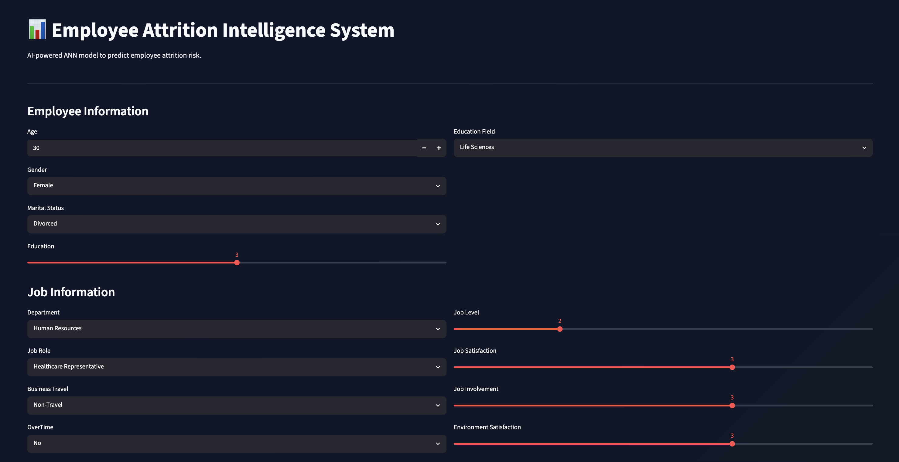
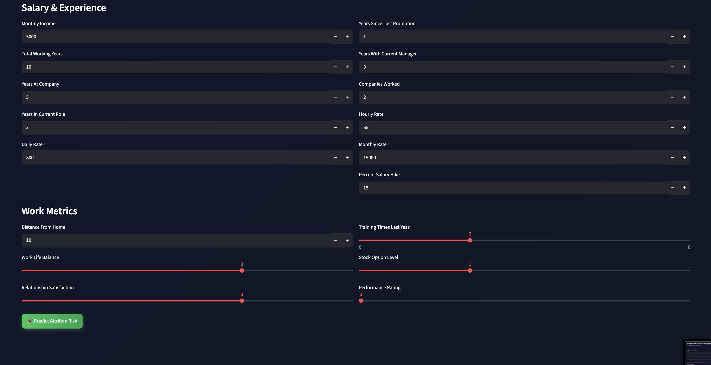
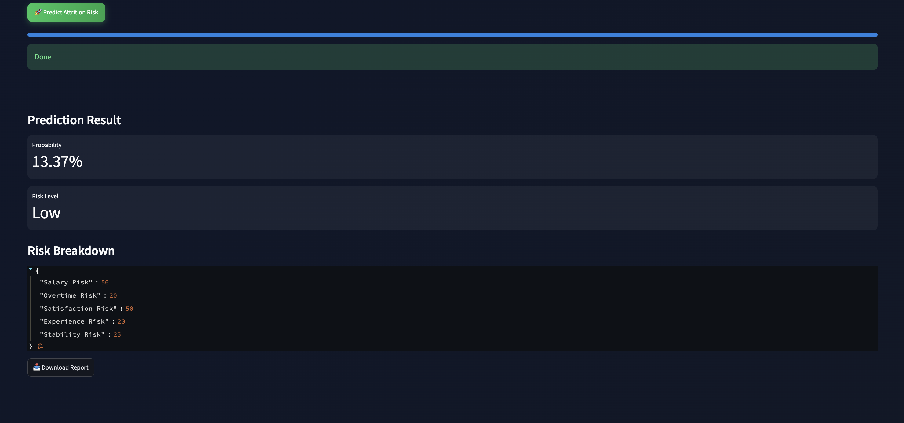

# 📊 Employee Attrition Intelligence System

An AI-powered **Employee Attrition Prediction System** built using **Artificial Neural Networks (ANN)** that predicts employee turnover risk and provides explainable business insights, real-time risk scoring, and downloadable PDF reports.

---

## 🧠 Project Overview

Employee attrition is one of the most critical challenges in HR analytics.  
This system helps organizations:

- Predict whether an employee is likely to leave
- Understand key risk factors behind attrition
- Generate instant risk breakdown insights
- Export professional PDF reports for decision-making

Built with a **production-style ML pipeline + interactive Streamlit UI**.

---

## 📸 Application Screenshots

### 🏠 Main Dashboard


---



---



---

## 🎯 Key Features

### 🤖 AI Prediction Engine
- Artificial Neural Network (ANN) trained on HR attrition dataset
- Predicts probability of employee leaving
- Real-time inference with CPU-optimized TensorFlow

### 📊 Risk Intelligence Dashboard
- Salary Risk Analysis
- Overtime Risk Impact
- Job Satisfaction Analysis
- Experience-based Risk Scoring
- Stability Risk Evaluation

### 🎨 Modern UI/UX
- Dark-themed professional interface
- Smooth progress animation during prediction
- Color-coded risk indicators (🟢🟡🔴)
- Interactive form-based input system

### 📄 PDF Report Generator
- One-click downloadable employee report
- Includes:
  - Attrition probability
  - Risk level classification
  - Full risk breakdown summary

### ⚙ Production-Ready Design
- Cached model loading (`@st.cache_resource`)
- CPU-only inference mode for deployment stability
- Modular preprocessing pipeline
- Clean feature engineering structure

---

## 🧠 Tech Stack

### 🐍 Core ML / AI
- Python
- TensorFlow / Keras (ANN Model)
- Scikit-learn
- NumPy
- Pandas

### 🎨 Frontend / UI
- Streamlit
- Custom CSS Styling
- Interactive Widgets & Metrics

### 📄 Reporting
- ReportLab (PDF Generation)

### ⚙ Model Handling
- Joblib (Scaler persistence)
- TensorFlow SavedModel / Keras format

---

## 📁 Project Structure

```

artifacts/
employee_attrition_ann.keras
scaler.pkl

HR-Employee-Attrition.csv
HR_Employee_Attrition_ANN.ipynb
app.py
requirements.txt
practice_ann/
.gitignore
attrition_report.pdf (sample output)

```

---

## 🚀 How It Works

1. User inputs employee details (age, salary, role, etc.)
2. Data is encoded + preprocessed
3. ANN model predicts attrition probability
4. System calculates:
   - Internal ML probability
   - Business risk score
5. Results displayed in interactive dashboard
6. Optional PDF report generation

---

## 📊 Model Output

| Metric | Description |
|------|--------|
| Attrition Probability | AI model prediction |
| Risk Level | Low / Medium / High classification |
| Confidence Score | Model certainty indicator |
| Risk Breakdown | Business-driven heuristic analysis |

---

## ⚙ Installation & Run Locally

```bash
git clone https://github.com/your-username/employee-attrition-intelligence-system.git

cd employee-attrition-intelligence-system

pip install -r requirements.txt

streamlit run app.py

```

## 🌐 Deployment

This app is ready for deployment on:

Streamlit Community Cloud

## 🧠 Business Impact

This system helps HR teams:

- Reduce employee turnover cost
- Identify high-risk employees early
- Improve workplace satisfaction strategies
- Make data-driven HR decisions

## 👨‍💻 Author

Built as a full-stack ML + AI dashboard project demonstrating:

Deep Learning (ANN)
Data Engineering
UI/UX Design in Streamlit
Production deployment mindset


## ⭐ If you like this project

Give a ⭐ to the repository and connect for more AI/ML projects.